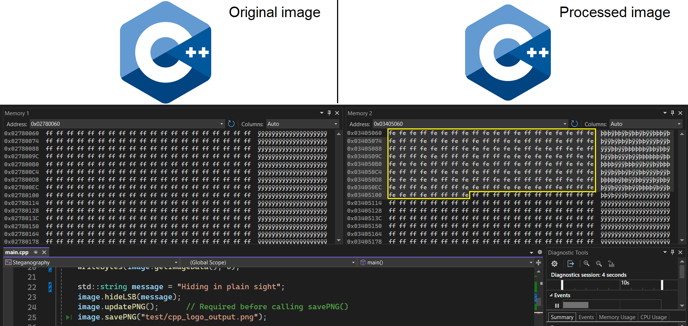

# Steganography

A simple C++ project that demonstrates how to hide and retrieve secret messages within images using steganography techniques.


## Features

- **Least Significant Bit (LSB) Steganography:**
	Hide messages in the least significant bits of image pixels.
- **Image File Support:**
	Works with PPM and PNG formats.
- **Message Encoding and Decoding:**
	Encode secret text messages into images and retrieve them with ease.


## Illustration

The image below compares a sample pair of original vs processed images and their pixel data.
The string 'Hiding in plain sight' has been encoded into the image on the right.



As can be seen, the original and processed images are visually indistinguishable.


## Prerequisites

- C++14 or later
- Microsoft Visual Studio 2022


## Installation

Clone the repository with its submodules:

```bash
git clone --recursive https://github.com/VarunVF/Steganography.git steganography-cpp
cd steganography-cpp
```

By default, for the dependencies `zlib` and `libpng`,
this solution uses the pre-built x86 and x64 binaries for Windows, stored at
`$(SolutionDir)Dependencies\libs`.

Otherwise for other platforms, follow the installation instructions depending on your platform:
- **Build zlib**: https://github.com/madler/zlib/blob/develop/README
- **Build libpng**: https://github.com/pnggroup/libpng/blob/libpng16/INSTALL


**Compile the project:**

In Visual Studio, click on "Build" > "Build Solution".
The executable and intermediates are saved in `$(SolutionDir)bin\` and `$(SolutionDir)bin\intermediates\` respectively.


## Usage

Hiding a message using PNG format:
```cpp
// Provide number of channels per pixel (4 = RGBA)
Image image(4);
image.loadPNG("input.png");

// Message to be hidden
std::string message = "secret";
image.hideLSB(message);

// Save the result with the encoded image
image.savePNG("output.png");
```

Recovering a message using PNG format:
```cpp
Image stegfile(4);
stegfile.loadPNG("hidden.png");

// Provide the number of characters to look for (e.g. 6)
std::string message = stegfile.findLSB(6);
```

Similar methods are available for PPM images.
```cpp
int Image::loadPPM(filename);
int Image::savePPM(filename);
```

Other useful methods are available
(See all methods in Image.hpp).
```cpp
// Get the width or height of an image
int Image::width() const;

// Get the height of the image
int Image::height() const;

// Get a reference to the image pixel data
std::vector<uint8_t>& Image::getImageData();
```